# Cloud-NSWI152

- poznámka: během dělání úkolů jsem použil dva různé Microsoft účty

## Lab 1
- podle instrukcí jsem založil a publikoval jednoduchou aplikaci

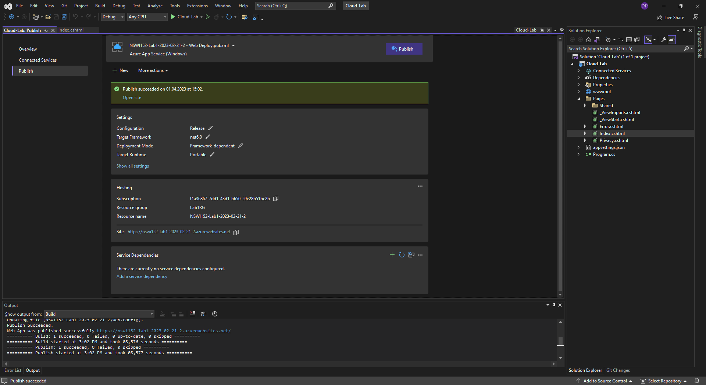

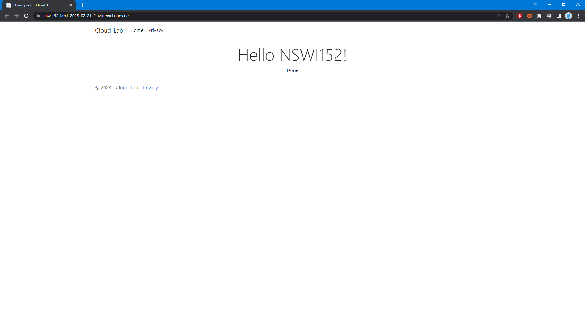

## Lab 2

- do projektu z předchozího labu jsem přidal WebJob

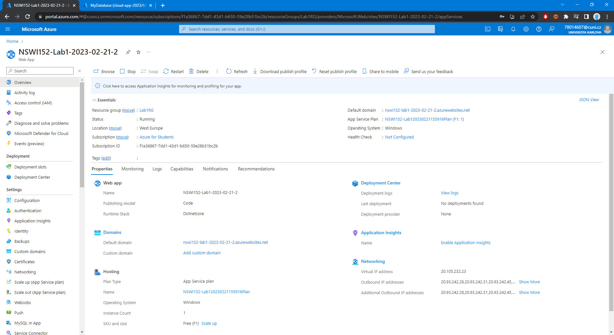

- vytvořil jsem Azure SQL databázi

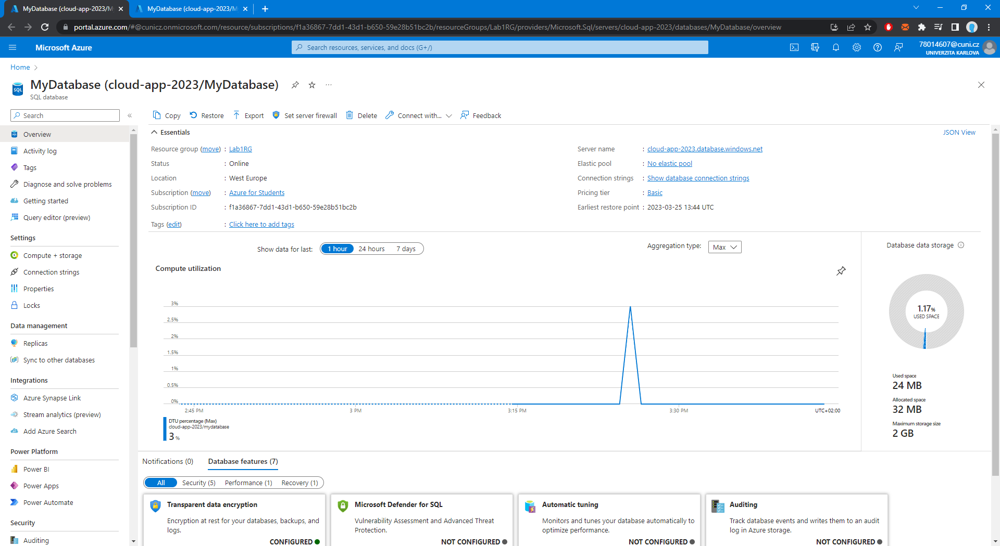

- pomocí příkazu jsem vytvořil tabulku

- aplikace úspěšně funguje

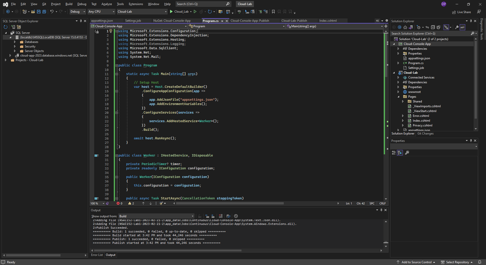

## Lab 3
- založil jsem Azure Storage a container

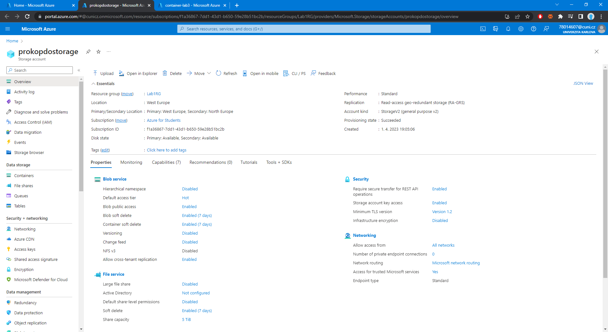

- přidal jsem connection string a aplikace úspěšně funguje

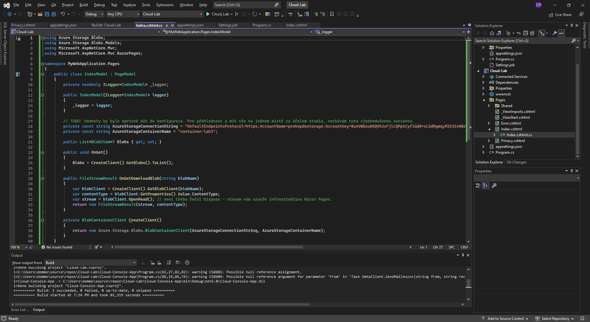

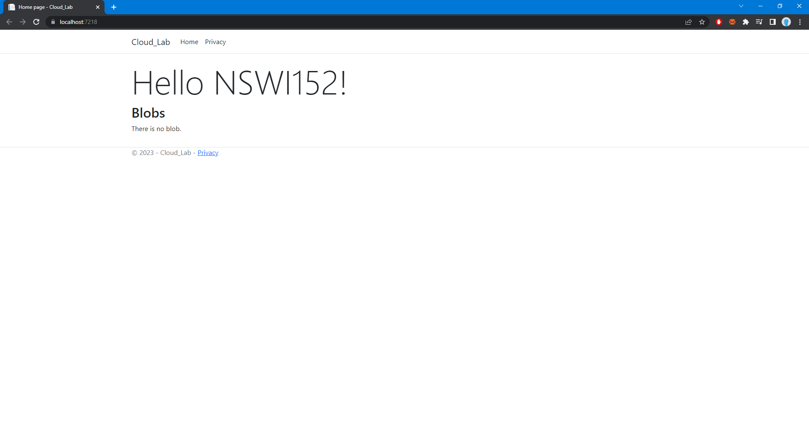

## Lab 4
- podle zadaného [tutoriálu](https://learn.microsoft.com/en-us/azure/cosmos-db/nosql/quickstart-dotnet?tabs=azure-portal%2Cwindows%2Cpasswordless%2Csign-in-azure-cli) jsem vytvořil svou Azure Cosmos DB

- přidal jsem do Visual Studia svůj cosmos endpoint a primary key, abych se odtud mohl připojit ke svému Azure Cosmos DB

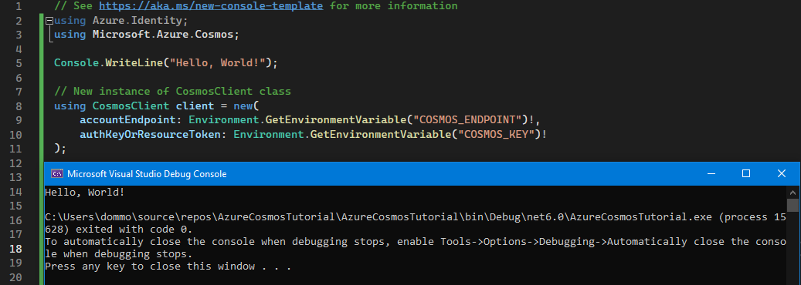

- vytvořil jsem databázi, kontejner a přidal do něj item, pak ho nahradil a updatnul

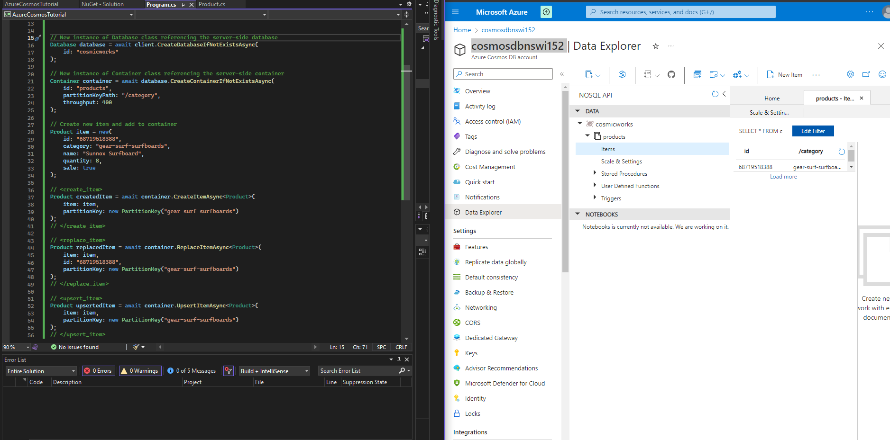

- získal jsem informace o vloženém itemu z databáze

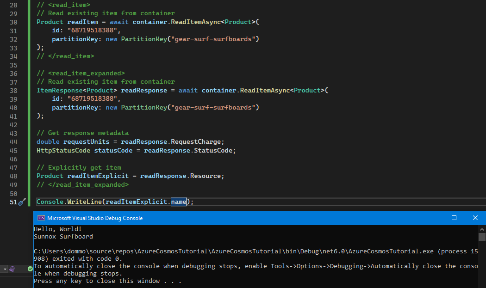

- na konec jsem vykonal jednoduchý dotaz pro získání všech itemů z dané partitiony a potom dotaz pro získání itemů podle určitých podmínek

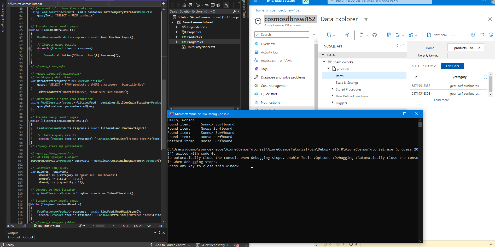

## Lab 5

- založil jsem Application Insights

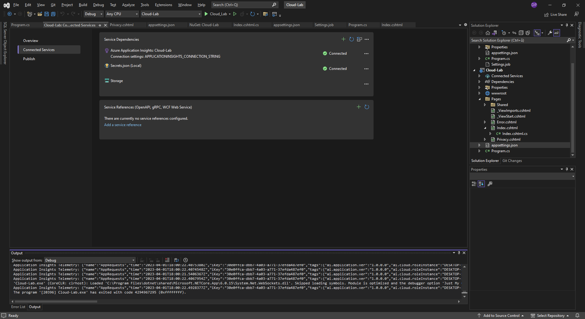

- přidal jsem telemetry

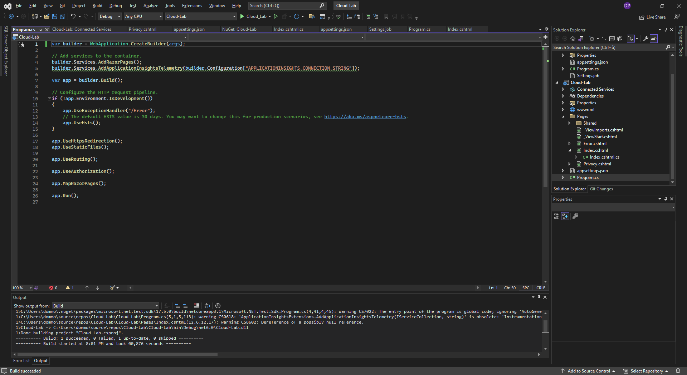

- aplikace úspěšně funguje

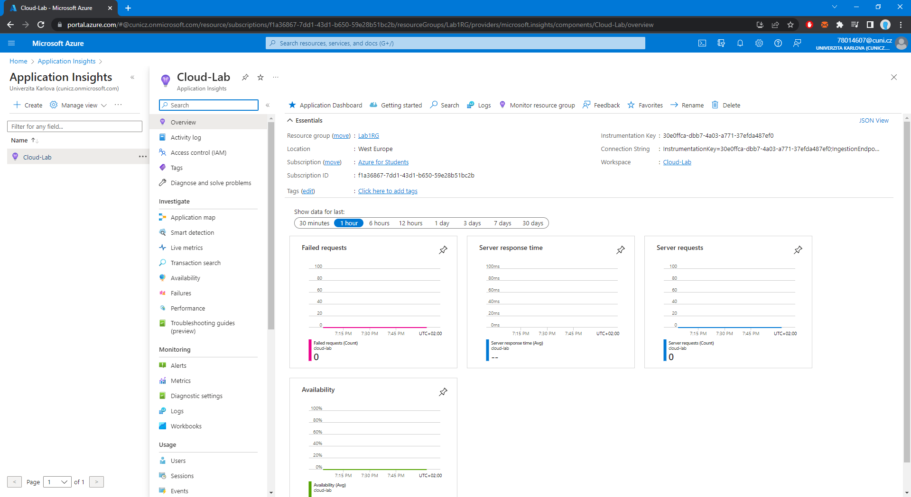

## Lab 6

- založil jsem KeyVault a vytovřil key a secret

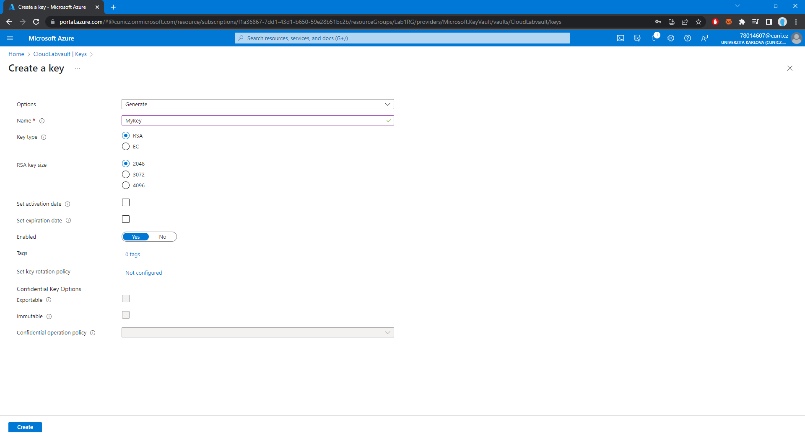

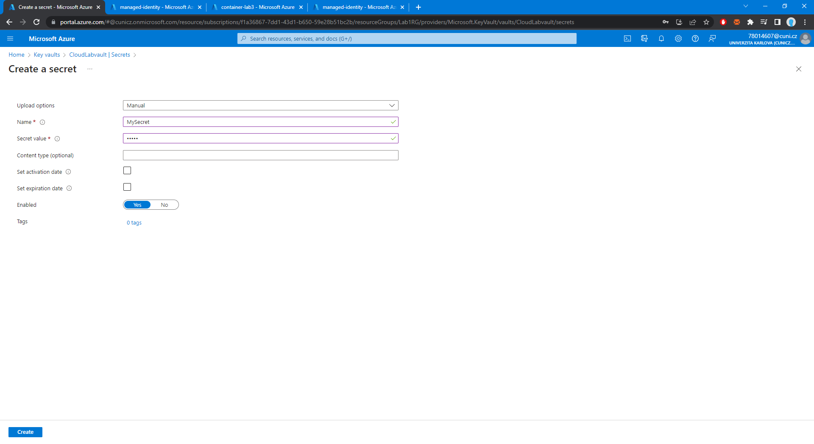

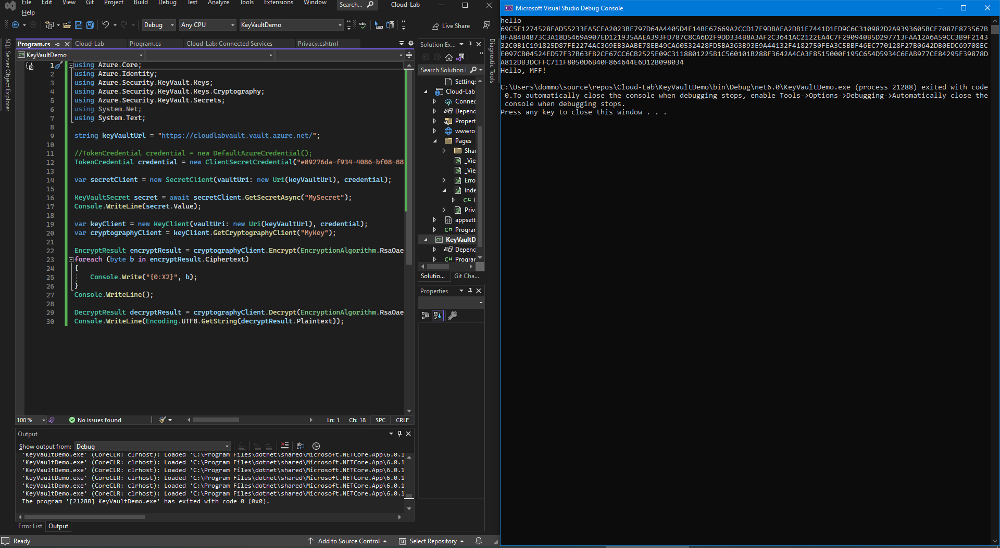

- aplikaci jsem přidal příslušná oprávnění

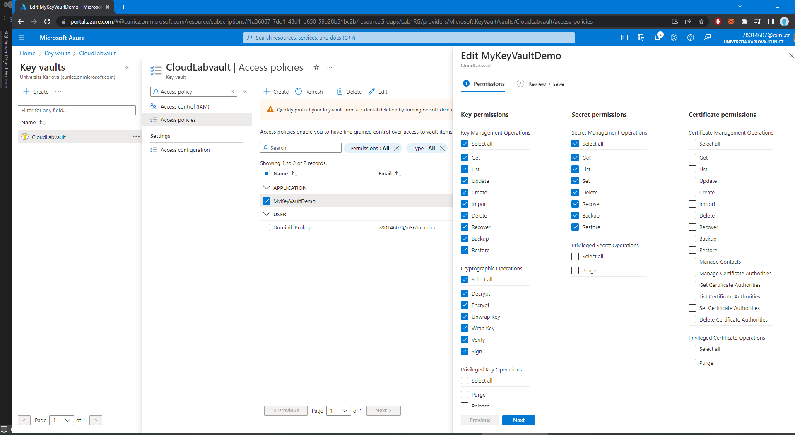

- aplikace úspěšně funguje (bohužel jsem zapomněl udělat screenshot a v ten den mi vypršelo předplatné)

