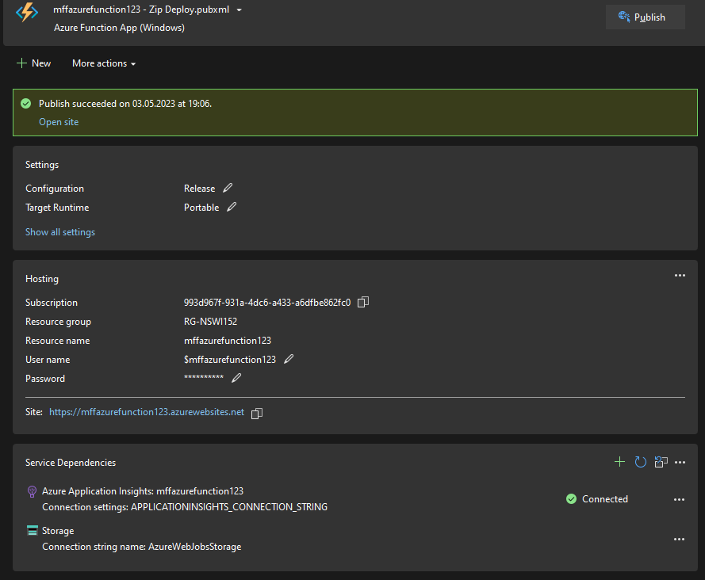

# Cloud-NSWI152

- poznámky:
    - během dělání úkolů jsem použil dva různé Microsoft účty
    - u některých screenshotů jde špatně vidět text, proto se hodí je otevřít v novém okně

## Lab 1
- podle instrukcí jsem založil a publikoval jednoduchou webovou aplikaci

## Lab 2

- do projektu z předchozího labu jsem přidal WebJob

- vytvořil jsem Azure SQL databázi

- vytvořil jsem tabulku

- aplikace s kódem ze zadání se úspěšně přeloží a běží

## Lab 3
- založil jsem Azure Storage a container

- přidal jsem connection string do poskytnutého kódu a aplikace úspěšně funguje

## Lab 4
- podle zadaného [tutoriálu](https://learn.microsoft.com/en-us/azure/cosmos-db/nosql/quickstart-dotnet?tabs=azure-portal%2Cwindows%2Cpasswordless%2Csign-in-azure-cli) jsem založil Azure Cosmos DB

- přidal jsem do Visual Studia svůj cosmos endpoint a primary key, abych se odtud mohl připojit ke svému Azure Cosmos DB

- vytvořil jsem databázi, kontejner a přidal do něj item, pak tento item nahradil a updatnul

- získal jsem informace o vloženém itemu z databáze

- na konec jsem vykonal jednoduchý dotaz pro získání všech itemů z dané partitiony a potom dotaz pro získání itemů podle určitých podmínek

## Lab 5

- založil jsem Application Insights

- mimo jiné jsem přidal telemetry

- v Azure portalu vidím informace o své webové aplikaci

## Lab 6

- založil jsem KeyVault a vytvořil key a secret s hodnotou "hello"

- v aplikaci jsem získal očekávaný secret z Azure portalu

- aplikaci jsem přidal příslušná oprávnění

- aplikace s poskytnutým kódem se úspěšně přeloží a běží

## Lab 7a

- založil jsem Event Hub

- zprovoznil jsem posílání zpráv mezi poskytnutými aplikacemi EventHubPublisher a EventHubConsumer
- v Azure portalu u Event Hubu vidím posílané události

## Lab 7b

- založil jsem Azure function

- lokálně jsem spustil funkci s poskytnutým kódem (při neplatném požadavku kód vrátí instanci třídy BadRequestObjectResult)

- funkci jsem publikoval

- nyní je funkce veřejně přístupná

- v Azure portalu vidím informace o této funkci

## Lab 7c

- založil jsem Logic app

- v Logic app jsem vytvořil požadovaný trigger

- použil jsem poskytnutou EventHubPublisher aplikaci pro poslání eventu do Event hubu, který aktivoval vytvořený trigger a poslal mi email

## Lab 8a

- založil jsem Computer vision

- použil jsem obrázek této třídy pro otestování

- aplikace s poskytnutým kódem mi pro tento obrázek vrátilá následující výstup

- spustil jsem to samé v konzoli

## Lab 8b

- vyzkoušel jsem Optical Character Recognition pro rozpoznání textu na obrázku

## Lab 8c

- založil jsem Face API

- aplikaci s poskytnutým kódem jsem dal na vstup fotku svého obličeje

## Lab 8d

- založil jsem Speech service

- vyzkoušel jsem projekt Speech SDK [(repo)](https://github.com/Azure-Samples/cognitive-services-speech-sdk)

- nahrál jsem do něj svůj klíč ze Speech service, použil modul pro rozpoznávání řeči a pokusil se v angličtině říct "NSWI152"

